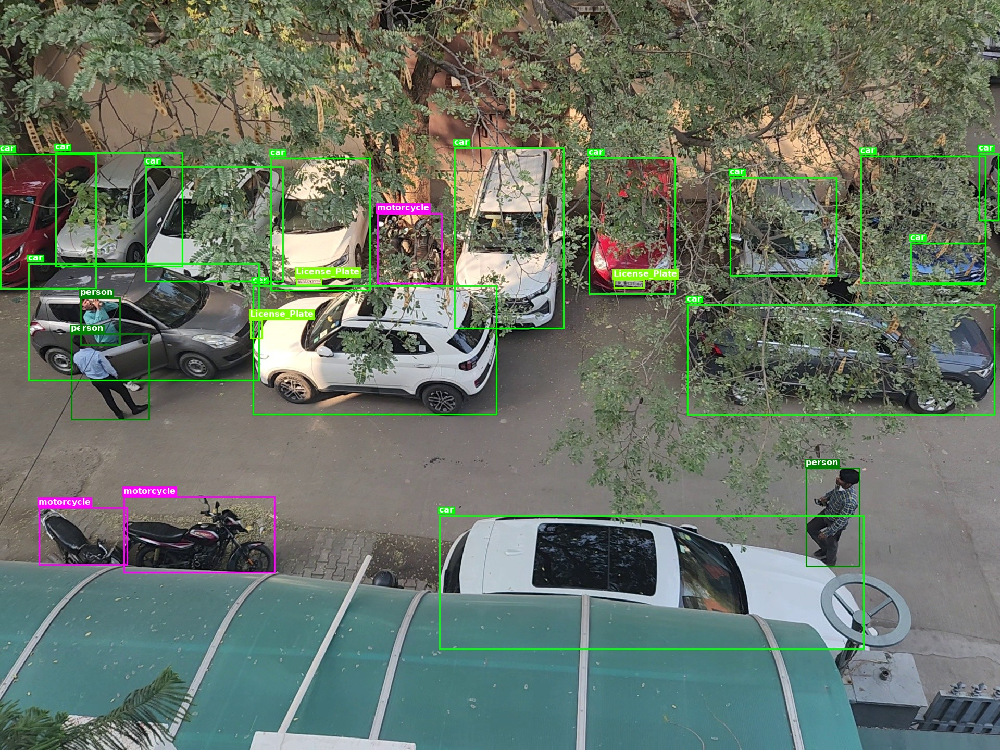
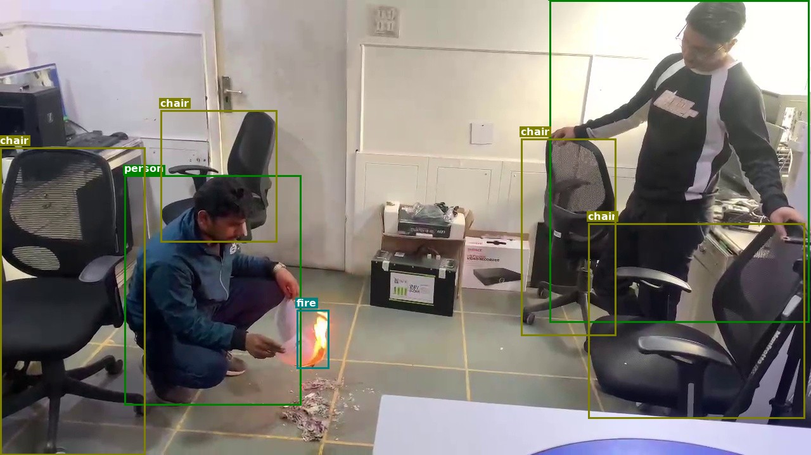
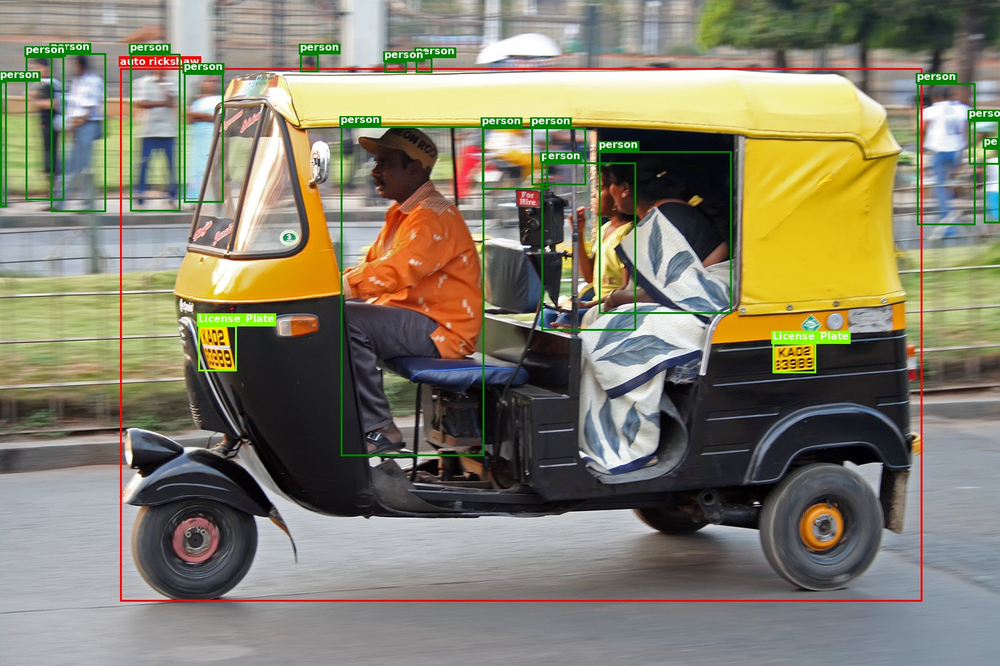

<p align="center">
  
</p>

<h1 align="center">🎯 SAM3 Auto-Labeler & YOLO Dataset Generator</h1>

<p align="center">
  <strong>Transform your unlabeled images into production-ready YOLO datasets in minutes, not hours.</strong>
</p>

<p align="center">
  <a href="#-quick-start">Quick Start</a> •
  <a href="#-features">Features</a> •
  <a href="#-yolo-dataset-tool">YOLO Tool</a> •
  <a href="#-api-reference">API</a> •
  <a href="#-contributing">Contributing</a>
</p>

<p align="center">
  
  
  
  
  
  
</p>

---

## 🌟 Why This Project?

Manual labeling is **slow**, **expensive**, and **error-prone**. This project leverages Meta's **SAM3 (Segment Anything Model 3)** to automatically detect and label objects in your images with incredible accuracy.

| Traditional Labeling | SAM3 Auto-Labeler |
|---------------------|-------------------|
| ⏱️ Hours per 100 images | ⚡ Minutes per 1000 images |
| 💰 $0.05-0.10 per label | 🆓 Free (self-hosted) |
| 😓 Human fatigue errors | 🎯 Consistent AI accuracy |
| 📦 Single format output | 🔄 YOLO-ready datasets |

---

## ✨ Features

<table>
<tr>
<td width="50%">

### 🚀 Core Capabilities
- **Open-Vocabulary Detection** - Detect ANY object by text prompt
- **80+ COCO Classes** - Pre-configured out of the box
- **Custom Concepts** - Add your own detection prompts
- **Real-time RTSP** - Process live video streams
- **Batch Processing** - 3-5x faster with parallel workers

</td>
<td width="50%">

### 🔧 Integrations
- **Label Studio** - ML backend for human-in-the-loop
- **YOLO Export** - Ready for YOLOv8/v9/v10 training
- **REST API** - Easy integration with any system
- **MJPEG Stream** - Live preview with annotations
- **Health Probes** - Kubernetes-ready deployment

</td>
</tr>
</table>

---

## 🚀 Quick Start

### Prerequisites

```bash
# Python 3.10+ required
python --version

# Install PyTorch with CUDA (adjust for your CUDA version)
pip install torch==2.7.0 torchvision==0.22.0 torchaudio==2.7.0 \
  --index-url https://download.pytorch.org/whl/cu126
```

### Installation

```bash
# Clone the repository
git clone https://github.com/ranjanjyoti152/Auto-labler-sam3.git
cd Auto-labler-sam3

# Create virtual environment
python -m venv .venv
source .venv/bin/activate  # On Windows: .venv\Scripts\activate

# Install dependencies
pip install --upgrade pip
pip install -r requirements.txt

# Configure environment
cp .env.example .env
# Edit .env with your settings (HuggingFace token, Label Studio URL, etc.)
```

### Start the Server

```bash
uvicorn app.main:app --reload --host 0.0.0.0 --port 8000
```

🎉 Open http://localhost:8000 to access the web interface!

---

## 🐳 Docker Deployment

For easy deployment with GPU support, use Docker:

### Prerequisites

- **Docker** 20.10+ with [NVIDIA Container Toolkit](https://docs.nvidia.com/datacenter/cloud-native/container-toolkit/install-guide.html)
- **NVIDIA GPU** with CUDA 12.6 compatible drivers

### Quick Start with Docker Compose

```bash
# Clone and configure
git clone https://github.com/ranjanjyoti152/Auto-labler-sam3.git
cd Auto-labler-sam3
cp .env.example .env
# Edit .env with your HuggingFace token and settings

# Start the service
docker compose up -d

# Check logs
docker compose logs -f

# Stop the service
docker compose down
```

### Build from Source

```bash
# Build the Docker image
docker build -t sam3-auto-labeler .

# Run with GPU support
docker run -d \
  --gpus all \
  -p 8000:8000 \
  -v ./weights:/app/weights \
  --env-file .env \
  --name sam3-auto-labeler \
  sam3-auto-labeler
```

### Environment Variables

Create a `.env` file (or copy from `.env.example`) with at minimum:

```env
SAM3_HF_TOKEN=your_huggingface_token_here
SAM3_DEVICE=cuda
```

See [Configuration](#️-configuration) for all available options.

🎉 Access the web interface at http://localhost:8000

---

## 🎯 YOLO Dataset Preparation Tool

<p align="center">
  <strong>The fastest way to create YOLO datasets from Label Studio projects</strong>
</p>

### Key Features

| Feature | Description |
|---------|-------------|
| 📥 **Smart Fetching** | Streams images one-by-one (memory efficient) |
| ⚡ **Batch Processing** | Parallel downloads for 3-5x speedup |
| 🤖 **Auto-Labeling** | SAM3 automatically detects objects |
| 📊 **Progress Tracking** | Beautiful CLI with stats & ETA |
| 🖼️ **Preview Images** | Verify detections with visual previews |
| 📁 **YOLO Format** | Ready for training with `dataset.yaml` |

### Usage Examples

```bash
# 🚀 Quick auto-label (recommended)
python tools/prepare_yolo_dataset.py \
  -p 1 \
  --auto-label \
  -o ./datasets/my_project \
  --force

# ⚡ Fast batch processing for large datasets
python tools/prepare_yolo_dataset.py \
  -p 1 \
  --auto-label \
  -o ./datasets/my_project \
  --batch-size 20 \
  --workers 8

# 🔍 With preview images for verification
python tools/prepare_yolo_dataset.py \
  -p 1 \
  --auto-label \
  -o ./datasets/my_project \
  --save-preview \
  --max-tasks 50

# 📝 Use existing Label Studio annotations
python tools/prepare_yolo_dataset.py \
  -p 1 \
  --use-existing \
  -o ./datasets/my_project
```

### CLI Options

| Option | Description | Default |
|--------|-------------|---------|
| `-p, --project-id` | Label Studio project ID | *required* |
| `-o, --output-dir` | Output directory for dataset | *required* |
| `--auto-label` | Auto-label with SAM3 | `false` |
| `--use-existing` | Use Label Studio annotations | `false` |
| `--batch-size` | Tasks per batch | `10` |
| `--workers` | Parallel download workers | `4` |
| `--save-preview` | Save preview images | `false` |
| `--max-tasks` | Limit tasks (0 = all) | `0` |
| `--train-split` | Train ratio | `0.8` |
| `--val-split` | Validation ratio | `0.15` |
| `--test-split` | Test ratio | `0.05` |
| `--force` | Overwrite existing output | `false` |
| `--no-batch` | Disable batch mode | `false` |

### Output Structure

```
datasets/my_project/
├── 📁 train/
│   ├── 📁 images/     # Training images
│   └── 📁 labels/     # YOLO format labels
├── 📁 val/
│   ├── 📁 images/     # Validation images
│   └── 📁 labels/     # YOLO format labels
├── 📁 test/
│   ├── 📁 images/     # Test images
│   └── 📁 labels/     # YOLO format labels
└── 📄 dataset.yaml    # YOLO training config
```

### Train Your Model

```bash
# Train YOLOv8 with your new dataset
yolo detect train data=./datasets/my_project/dataset.yaml model=yolov8n.pt epochs=100

# Or use YOLOv9/v10
yolo detect train data=./datasets/my_project/dataset.yaml model=yolov9c.pt epochs=100
```

---

## 📸 Sample Detection Previews

<p align="center">
  <em>SAM3 auto-labeling results with bounding boxes</em>
</p>

<table>
<tr>
<td align="center">

<br/>
<em>Traffic Scene Detection</em>
</td>
<td align="center">

<br/>
<em>Indoor Object Detection</em>
</td>
<td align="center">

<br/>
<em>Auto-Rickshaw Detection</em>
</td>
</tr>
</table>

---

## 🔌 API Reference

### Detection Endpoint

```bash
POST /detect
```

Analyze RTSP stream or image for objects.

```bash
curl -X POST http://localhost:8000/detect \
  -H "Content-Type: application/json" \
  -d '{
    "rtsp_url": "rtsp://192.168.1.50:8554/live",
    "max_frames": 2,
    "concepts": ["fire", "smoke", "safety helmet"]
  }'
```

<details>
<summary>📤 Response Example</summary>

```json
{
  "frames_analyzed": 2,
  "detections": [
    {
      "frame_index": 0,
      "label": "fire",
      "bbox": {"x": 120, "y": 33, "width": 188, "height": 201},
      "area": 29000,
      "score": 0.93
    }
  ]
}
```
</details>

### Live Stream Preview

```bash
GET /live-stream?rtsp_url=rtsp://...&frame_skip=1
```

Returns MJPEG stream with real-time annotations.

### Label Studio Integration

```bash
POST /predict
```

ML backend endpoint for Label Studio human-in-the-loop workflows.

<details>
<summary>📋 Example Request</summary>

```bash
curl -X POST http://localhost:8000/predict \
  -H "Content-Type: application/json" \
  -d '{
    "tasks": [
      {
        "id": "task-1",
        "data": {
          "rtsp_url": "rtsp://192.168.1.50:8554/live",
          "frame_skip": 1,
          "concepts": ["person", "safety helmet"]
        }
      }
    ]
  }'
```
</details>

### Health Check

```bash
GET /healthz
```

Kubernetes-ready liveness probe.

---

## ⚙️ Configuration

### Environment Variables

Create a `.env` file with these settings:

```env
# 🔑 Required: HuggingFace token for SAM3 model
SAM3_HF_TOKEN=your_hf_token_here

# 🎯 Model Settings
SAM3_CHECKPOINT_PATH=./weights/sam3.pt
SAM3_DEVICE=cuda

# 📊 Detection Thresholds
SAM3_SCORE_THRESHOLD=0.35      # Lower = more detections
SAM3_MAX_DETECTIONS=250        # Max boxes per image
SAM3_MIN_BOX_AREA=500          # Filter small boxes
SAM3_NMS_THRESHOLD=0.3         # Non-max suppression
SAM3_CROSS_CLASS_NMS=true      # Remove cross-class overlaps

# 🏷️ Label Studio Integration
SAM3_LABELSTUDIO_API_BASE=http://your-labelstudio:8080
SAM3_LABELSTUDIO_API_TOKEN=your_token_here

# ⚡ Batch Processing
YOLO_BATCH_SIZE=10
YOLO_WORKERS=4
```

<details>
<summary>📋 All Configuration Options</summary>

| Variable | Description | Default |
|----------|-------------|---------|
| `SAM3_CHECKPOINT_PATH` | Local model path | `None` |
| `SAM3_HF_TOKEN` | HuggingFace token | `None` |
| `SAM3_DEVICE` | `cuda` or `cpu` | `cuda` |
| `SAM3_SCORE_THRESHOLD` | Min detection confidence | `0.50` |
| `SAM3_MAX_DETECTIONS` | Max detections per frame | `25` |
| `SAM3_RTSP_TIMEOUT` | RTSP connection timeout | `5` |
| `SAM3_FRAME_SKIP` | Frames to skip | `1` |
| `SAM3_CONCEPTS_PATH` | Custom concepts file | `None` |
| `SAM3_EXTRA_CONCEPTS` | Additional prompts | `None` |
| `SAM3_USE_DEFAULT_CONCEPTS` | Use COCO classes | `true` |
| `SAM3_MAX_CONCEPTS_PER_REQUEST` | Concept limit | `160` |
| `SAM3_LABELSTUDIO_FROM_NAME` | LS control tag | `label` |
| `SAM3_LABELSTUDIO_TO_NAME` | LS object tag | `image` |
| `SAM3_LABELSTUDIO_MODEL_VERSION` | Model version string | `sam3-v0.1` |

</details>

---

## 🏗️ Architecture

```
┌─────────────────────────────────────────────────────────────────┐
│                         Client Layer                            │
│  ┌──────────┐  ┌──────────┐  ┌──────────┐  ┌──────────────┐   │
│  │ Web UI   │  │ REST API │  │  RTSP    │  │ Label Studio │   │
│  └────┬─────┘  └────┬─────┘  └────┬─────┘  └──────┬───────┘   │
└───────┼─────────────┼─────────────┼───────────────┼────────────┘
        │             │             │               │
┌───────▼─────────────▼─────────────▼───────────────▼────────────┐
│                     FastAPI Server (Uvicorn)                    │
│  ┌─────────────┐  ┌─────────────┐  ┌─────────────────────────┐ │
│  │  /detect    │  │ /live-stream│  │      /predict           │ │
│  └──────┬──────┘  └──────┬──────┘  └───────────┬─────────────┘ │
└─────────┼────────────────┼─────────────────────┼───────────────┘
          │                │                     │
┌─────────▼────────────────▼─────────────────────▼───────────────┐
│                     SAM3 Detection Engine                       │
│  ┌──────────────┐  ┌───────────────┐  ┌──────────────────────┐ │
│  │ COCO Classes │  │ Safety Prompts│  │  Custom Concepts     │ │
│  │   (80+)      │  │  (PPE, Fire)  │  │   (User-defined)     │ │
│  └──────────────┘  └───────────────┘  └──────────────────────┘ │
└────────────────────────────────────────────────────────────────┘
```

---

## 🤝 Contributing

We love contributions! Here's how you can help make this project even better:

### 🌈 Ways to Contribute

| Type | Description |
|------|-------------|
| 🐛 **Bug Reports** | Found a bug? [Open an issue](https://github.com/ranjanjyoti152/Auto-labler-sam3/issues/new) |
| 💡 **Feature Requests** | Have an idea? Let's discuss it! |
| 📝 **Documentation** | Help improve our docs |
| 🔧 **Code** | Submit a pull request |
| ⭐ **Star** | Star this repo to show support! |

### 🛠️ Development Setup

```bash
# Fork and clone
git clone https://github.com/YOUR_USERNAME/Auto-labler-sam3.git
cd Auto-labler-sam3

# Create feature branch
git checkout -b feature/amazing-feature

# Make changes and test
python -m pytest tests/

# Commit and push
git commit -m "Add amazing feature"
git push origin feature/amazing-feature

# Open a Pull Request!
```

### 📏 Code Style

- Follow **PEP 8** guidelines
- Add **docstrings** to functions
- Write **tests** for new features
- Update **README** for user-facing changes

### 🎯 Good First Issues

Looking for something to work on? Check out our [good first issues](https://github.com/ranjanjyoti152/Auto-labler-sam3/labels/good%20first%20issue)!

---

## 📊 Roadmap

- [x] SAM3 integration with open-vocabulary detection
- [x] RTSP stream processing
- [x] Label Studio ML backend
- [x] YOLO dataset generation tool
- [x] Batch processing with parallel workers
- [x] 🐳 Docker image for easy deployment
- [ ] ☸️ Kubernetes Helm chart
- [ ] 🖥️ Web UI for dataset management
- [ ] 🎬 Support for video file input
- [ ] 🚀 Multi-GPU inference
- [ ] 🎓 Model fine-tuning pipeline

---

## ❓ FAQ

<details>
<summary><b>Q: What hardware do I need?</b></summary>

**A:** For best performance, use a GPU with at least 8GB VRAM. CPU-only mode works but is significantly slower.
</details>

<details>
<summary><b>Q: Can I use custom detection prompts?</b></summary>

**A:** Yes! Add prompts via `SAM3_EXTRA_CONCEPTS` in `.env` or pass them in API requests.
</details>

<details>
<summary><b>Q: How do I integrate with Label Studio?</b></summary>

**A:** Register the ML backend at `http://your-server:8000/predict` in Label Studio Settings → Machine Learning.
</details>

<details>
<summary><b>Q: What YOLO versions are supported?</b></summary>

**A:** The generated datasets work with YOLOv5, YOLOv8, YOLOv9, YOLOv10, and any YOLO-format compatible model.
</details>

---

## 📜 License

This project is licensed under the **MIT License** - see the [LICENSE](LICENSE) file for details.

---

## 🙏 Acknowledgments

- [Meta AI](https://ai.meta.com/) for the incredible SAM3 model
- [Ultralytics](https://ultralytics.com/) for YOLO
- [Label Studio](https://labelstud.io/) for the annotation platform
- All our amazing contributors! 💖

---

<p align="center">
  <strong>Made with ❤️ for the Computer Vision Community</strong>
</p>

<p align="center">
  <a href="https://github.com/ranjanjyoti152/Auto-labler-sam3/stargazers">
    
  </a>
</p>

<p align="center">
  <sub>Built with 🔥 by <a href="https://github.com/ranjanjyoti152">@ranjanjyoti152</a></sub>
</p>
